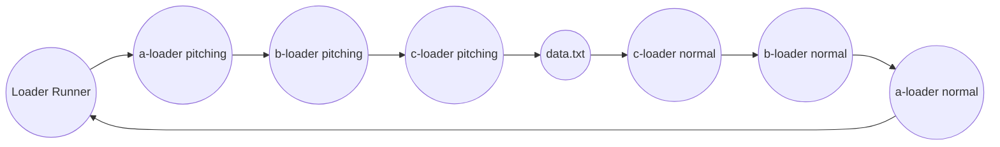

# https://juejin.cn/post/6992754161221632030
```
function simpleLoader(content,map,meta){
  console.log('this is loader')
  return content
}
module.exports = simpleLoader
```
 Webpack 中，loader 可以被分为 4 类：
 pre 前置、
 post 后置、
 normal 普通和 
 inline 行内。
 其中 pre 和 post loader，可以通过 rule 对象的 enforce 属性来指定

 ```
 // webpack.config.js
const path = require("path");

module.exports = {
  module: {
    rules: [
      {
        test: /\.txt$/i,
        use: ["a-loader"],
        enforce: "post", // post loader
      },
      {
        test: /\.txt$/i,
        use: ["b-loader"], // normal loader
      },
      {
        test: /\.txt$/i,
        use: ["c-loader"],
        enforce: "pre", // pre loader
      },
    ],
  },
};
```
 
 # Webpack 的配置文件中，设置 resolveLoader 属性
 ```
 const path = require("path");

module.exports = {
  entry: "./src/index.js",
  output: {
    filename: "bundle.js",
    path: path.resolve(__dirname, "dist"),
  },
  mode: "development",
  module: {
    rules: [
      {
        test: /\.txt$/i,
        use: ["a-loader", "b-loader", "c-loader"],
      },
    ],
  },
  resolveLoader: {
    modules: [
      path.resolve(__dirname, "node_modules"),
      path.resolve(__dirname, "loaders"),
    ],
  },
};
```

# Pitching Loader
```
/**
 * @remainingRequest 剩余请求
 * @precedingRequest 前置请求
 * @data 数据对象
 */
function (remainingRequest, precedingRequest, data) {
 // some code
};

function aLoader(content, map, meta) {
  // 省略部分代码
}

aLoader.pitch = function (remainingRequest, precedingRequest, data) {
  console.log("开始执行aLoader Pitching Loader");
  console.log(remainingRequest, precedingRequest, data)
};

module.exports = aLoader;
```
Pitching Loader 的执行顺序是 从左到右，
而 Normal Loader 的执行顺序是 从右到左




> 当某个 Pitching Loader 返回非 undefined 值时，就会实现熔断效果


> 当pitching 返回非空 发生熔断 停止后面的pitching 以及后面的loader 执行之前已执行的pitcher的loader的normal

会根据当前 loader 对象 pitch 函数的返回值是否为 undefined 来执行不同的处理逻辑。如果 pitch 函数返回了非 undefined 的值，则会出现熔断。即跳过后续的执行流程，开始执行上一个 loader 对象上的 normal loader 函数。具体的实现方式也很简单，就是 loaderIndex 的值减 1，然后调用 iterateNormalLoaders 函数来实现。而如果 pitch 函数返回 undefined，则继续调用 iteratePitchingLoaders 函数来处理下一个未处理 loader 对象。

# 同步 Loader 和异步 Loader

Loader 可以分为同步 Loader 和异步 Loader，对于同步 Loader 来说，我们可以通过 return 语句或 this.callback 的方式来同步地返回转换后的结果。只是相比 return 语句，this.callback 方法则更灵活，因为它允许传递多个参数。

```
module.exports = function(source) {
  return source + "-simple";
};

module.exports = function (source, map, meta) {
  this.callback(null, source + "-simple", map, meta);
  return; // 当调用 callback() 函数时，总是返回 undefined
};

// this.callback 方法支持 4 个参数
this.callback(
  err: Error | null,    // 错误信息
  content: string | Buffer,    // content信息
  sourceMap?: SourceMap,    // sourceMap
  meta?: any    // 会被 webpack 忽略，可以是任何东西
);

```

> 异步 loader，我们需要调用 this.async 方法来获取 callback 函数

```
module.exports = function(source) {
   var callback = this.async();
   setTimeout(function() {
     callback(null, source + "-async-simple");
   }, 50);
};
```
```
function runSyncOrAsync(fn, context, args, callback) {
	var isSync = true; // 默认是同步类型
	var isDone = false; // 是否已完成
	var isError = false; // internal error
	var reportedError = false;
  
	context.async = function async() {
	  if(isDone) {
	    if(reportedError) return; // ignore
	    throw new Error("async(): The callback was already called.");
	  }
	  isSync = false;
	  return innerCallback;
	};
}
```
runSyncOrAsync 函数的作用，该函数用于执行 Loader 模块中设置的 Normal Loader 或 Pitching Loader 函数。在 runSyncOrAsync 函数内部，最终会通过 fn.apply(context, args) 的方式调用 Loader 函数。即会通过 apply 方法设置 Loader 函数的执行上下文

当调用 this.async 方法之后，会先设置 isSync 的值为 false，然后返回 innerCallback 函数。其实该函数与 this.callback 都是指向同一个函数

./src/index.js 对应的函数内部，会通过调用 __webpack_require__ 函数来导入 ./src/data.txt 路径中的内容。而在 __webpack_require__ 函数内部会优先从缓存对象中获取 moduleId 对应的模块，若该模块已存在，就会返回该模块对象上 exports 属性的值。如果缓存对象中不存在 moduleId 对应的模块，则会创建一个包含 exports 属性的 module 对象，然后会根据 moduleId 从 __webpack_modules__ 对象中，获取对应的函数并使用相应的参数进行调用，最终返回 module.exports 的值。所以在 a-loader.js 文件中，把 content 赋值给 module.exports 属性的目的是为了导出相应的内容。


# 使用 Loader 实用工具
请好好利用 loader-utils 包，它提供了很多有用的工具，最常用的一个就是获取传入 loader 的 options。除了 loader-utils 之外包还有 schema-utils 包，我们可以用 schema-utils 提供的工具，获取用于校验 options 的 JSON Schema 常量，从而校验 loader options。下面给出的例子简要地结合了上面提到的两个工具包

```
import { getOptions } from 'loader-utils';
import { validateOptions } from 'schema-utils';

const schema = {
  type: object,
  properties: {
    test: {
      type: string
    }
  }
}

export default function(source) {
    const options = getOptions(this);

    validateOptions(schema, options, 'Example Loader');

    // 在这里写转换 source 的逻辑 ...
    return `export default ${ JSON.stringify(source) }`;
};
```

# loader 的依赖

> 文件依赖
var headerPath = path.resolve('header.js');
this.addDependency(headerPath);

```
import path from 'path';

export default function(source) {
    var callback = this.async();
    var headerPath = path.resolve('header.js');

    this.addDependency(headerPath);

    fs.readFile(headerPath, 'utf-8', function(err, header) {
        if(err) return callback(err);
        //这里的 callback 相当于异步版的 return
        callback(null, header + "\n" + source);
    });
};
```

> 模块依赖
不同的模块会以不同的形式指定依赖。比如在 CSS 中我们使用 @import 和 url(...) 声明来完成指定，而我们应该让模块系统解析这些依赖。
如何让模块系统解析不同声明方式的依赖呢？下面有两种方法：

把不同的依赖声明统一转化为 require 声明。
通过 this.resolve 函数来解析路径。

对于第一种方式，有一个很好的例子就是 css-loader。它把 @import 声明转化为 require 样式表文件，把 url(...) 声明转化为 require 被引用文件。
而对于第二种方式，则需要参考一下 less-loader。由于要追踪 less 中的变量和 mixin，我们需要把所有的 .less 文件一次编译完毕，所以不能把每个 @import 转为 require。因此，less-loader 用自定义路径解析逻辑拓展了 less 编译器。这种方式运用了我们刚才提到的第二种方式 —— this.resolve 通过 webpack 来解析依赖

> 代码公用
避免在多个 loader 里面初始化同样的代码，请把这些共用代码提取到一个运行时文件里，然后通过 require 把它引进每个 loader

> 同伴依赖

```
"peerDependencies": {
  "node-sass": "^4.0.0"
}
```


# demo 
webpack
```
module: {
    rules: [{
        test: /\.html$/,
        use: ['html-loader', 'html-minify-loader'] // 处理顺序 html-minify-loader => html-loader => webpack
    }]
},
resolveLoader: {
    // 因为 html-loader 是开源 npm 包，所以这里要添加 'node_modules' 目录
    modules: [path.join(__dirname, './src/loaders'), 'node_modules']
}
```
loader.js

```
var Minimize = require('minimize');  // 引用3方
var loaderUtils = require('loader-utils');

module.exports = function(source) {
    var callback = this.async(); //异步
    if (this.cacheable) {       // 开启缓存
        this.cacheable();
    }
    var opts = loaderUtils.getOptions(this) || {};
    var minimize = new Minimize(opts);
    return minimize.parse(source, callback);
};

```


直接使用 this.callback() 这个 api，然后在最后直接 **return undefined **的方式告诉 
webpack 去 this.callback() 寻找他要的结果，这个 api 接受这些参数：
this.callback(  
   err: Error | null, // 一个无法正常编译时的 Error 或者 直接给个 null   
   content: string | Buffer,// 我们处理后返回的内容 可以是 string 或者 Buffer（）   
   sourceMap?: SourceMap, // 可选 可以是一个被正常解析的 source map   
   meta?: any // 可选 可以是任何东西，比如一个公用的 AST 语法树 
  ); 

# 从 webpack 5 开始，this.getOptions 可以获取到 loader 上下文对象。
它用来替代来自loader-utils中的 getOptions 方法。
```
module.exports = function (content) {   // 获取到用户传给当前 loader 的参数   
  const options = this.getOptions()   
  const res = someSyncOperation(content, options)   
  this.callback(null, res, sourceMaps);   // 注意这里由于使用了 this.callback 直接 return 就行   
  return 
} 
```

再来说说异步： 
同步与异步的区别很好理解，一般我们的转换流程都是同步的，但是当我们遇到譬如需要网络请求等场景，那么为了避免阻塞构建步骤，我们会采取异步构建的方式，对于异步 loader 我们主要需要使用 this.async() 来告知 webpack 这次构建操作是异步的，不多废话，看代码就懂了：
```
module.exports = function (content) {   
  var callback = this.async()   
  someAsyncOperation(content, function (err, result) {     
    if (err) return callback(err)     
    callback(null, result, sourceMaps, meta)   
  }) 
} 
```

# "Raw" loader

默认情况下，资源文件会被转化为 UTF-8 字符串，然后传给 loader。通过设置 raw 为 true，loader 可以接收原始的 Buffer。每一个 loader 都可以用 String 或者 Buffer 的形式传递它的处理结果。complier 将会把它们在 loader 之间相互转换。大家熟悉的 file-loader 就是用了这个。简而言之：你加上 module.exports.raw = true; 传给你的就是 Buffer 了，处理返回的类型也并非一定要是 Buffer，webpack 并没有限制。

```
module.exports = function (content) {   
  console.log(content instanceof Buffer); // true   
  return doSomeOperation(content) 
  } // 划重点↓ 
module.exports.raw = true; 
```

# Pitching loader
我们每一个 loader 都可以有一个 pitch 方法，大家都知道，loader 是按照从右往左的顺序被调用的，但是实际上，在此之前会有一个按照从左往右执行每一个 loader 的 pitch 方法的过程。pitch 方法共有三个参数：

remainingRequest：loader 链中排在自己后面的 loader 以及资源文件的绝对路径以!作为连接符组成的字符串。

precedingRequest：loader 链中排在自己前面的 loader 的绝对路径以!作为连接符组成的字符串。

data：每个 loader 中存放在上下文中的固定字段，可用于 pitch 给 loader 传递数据。

> 在 pitch 中传给 data 的数据，在后续的调用执行阶段，是可以在 this.data 中获取到的：

```
module.exports = function (content) {   
  return someSyncOperation(content, this.data.value);// 这里的 this.data.value === 42 
};  

module.exports.pitch = function (remainingRequest, precedingRequest, data) {   
  data.value = 42; 
}; 
```

this.addDependency：加入一个文件进行监听，一旦文件产生变化就会重新调用这个 loader 进行处理

this.cacheable：默认情况下 loader 的处理结果会有缓存效果，给这个方法传入 false 可以关闭这个效果

this.clearDependencies：清除 loader 的所有依赖

this.context：文件所在的目录(不包含文件名)

this.data：pitch 阶段和正常调用阶段共享的对象

this.getOptions(schema)：用来获取配置的 loader 参数选项

this.resolve：像 require 表达式一样解析一个 request。resolve(context: string, request: string, callback: function(err, result: string))

this.loaders：所有 loader 组成的数组。它在 pitch 阶段的时候是可以写入的。

this.resource：获取当前请求路径，包含参数：'/abc/resource.js?rrr'

this.resourcePath：不包含参数的路径：'/abc/resource.js'

this.sourceMap：bool 类型，是否应该生成一个 sourceMap

```
module.exports = function (source) {   
  const options = this.getOptions() // 获取 webpack 配置中传来的 option   
  this.callback(null, addSign(source, options.sign))   return 
  }  
  function addSign(content, sign) {  
     return `/** ${sign} */\n${content}` 
  } 
```
# resolveLoader
```
resolveLoader: {
  // 这里就是说先去找 node_modules 目录中，如果没有的话再去 loaders 目录查找
  modules: [
    'node_modules',
    path.resolve(__dirname, 'loaders')
  ]
}
```

# 二、Plugin

plugin 提供了很多比 loader 中更完备的功能，他使用阶段式的构建回调，webpack 给我们提供了非常多的 hooks 用来在构建的阶段让开发者自由的去引入自己的行为

一个 JavaScript 类
一个 apply 方法，apply 方法在 webpack 装载这个插件的时候被调用，并且会传入 compiler 对象。
使用不同的 hooks 来指定自己需要发生的处理行为
在异步调用时最后需要调用 webpack 提供给我们的 callback 或者通过 Promise 的方式（后续异步编译部分会详细说）

```
class HelloPlugin{
  apply(compiler){
    compiler.hooks.<hookName>.tap(PluginName,(params)=>{
      /** do some thing */
    })
  }
}
module.exports = HelloPlugin
```
# Compiler and Compilation
compiler 对象可以理解为一个和 webpack 环境整体绑定的一个对象，它包含了所有的环境配置，包括 options，loader 和 plugin，当 webpack 启动时，这个对象会被实例化，并且他是全局唯一的，上面我们说到的 apply 方法传入的参数就是它。
compilation 在每次构建资源的过程中都会被创建出来，一个 compilation 对象表现了当前的模块资源、编译生成资源、变化的文件、以及被跟踪依赖的状态信息。它同样也提供了很多的 hook 。
```
compiler/compilation.hooks.<hookName>.tap/tapAsync/tapPromise(pluginName,(xxx)=>{/**dosth*/})
```
