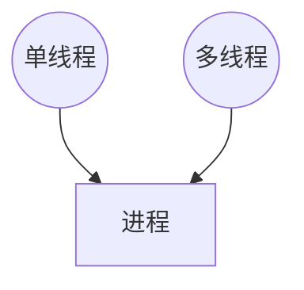
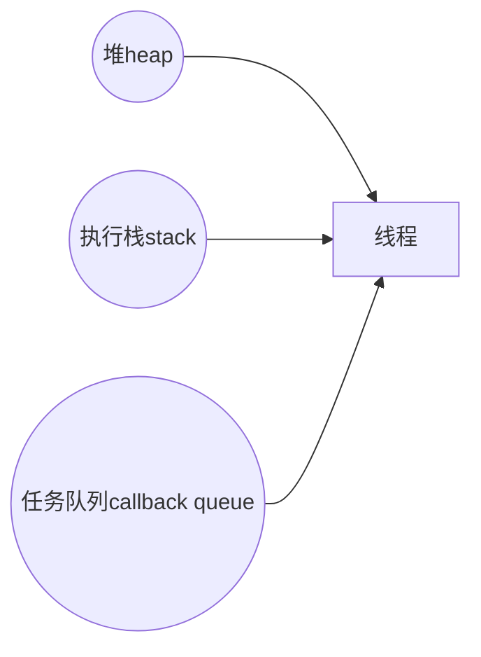
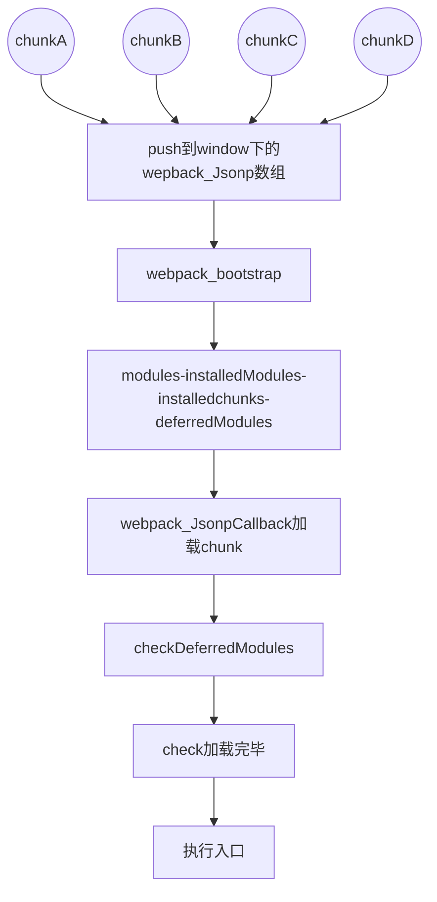

> 进程：运行的程序就是一个进程，比如你正在运行的浏览器，它会有一个进程；

>线程：程序中独立运行的代码段。一个进程 由单个或多个 线程 组成，线程是负责执行代码的。
单线程与多线程的区别：

>单线程：从头执行到尾，一行行执行，如果其中一行代码报错，那么剩下的代码将不再执行。同时容易代码阻塞。

>多线程：代码运行的环境不同，各线程独立，互不影响，避免阻塞

堆（heap）：对象被分配在一个堆中，即用以表示一个大部分非结构化的内存区域。

执行栈（stack）：运行同步代码。执行栈中的代码（同步任务），总是在读取 任务队列（异步任务）之前执行。

任务队列（callback queue）：
是一个事件的队列（也可以理解成消息的队列），IO 设备完成一项任务，就在 任务队列 中添加一个事件，表示相关的异步任务可以进入 执行栈 了。主线程读取 任务队列，就是读取里面有哪些事件。

所谓 回调函数（callback），就是那些会被主线程挂起来的代码。异步任务必须指定回调函数，当主线程开始执行异步任务，就是执行对应的回调函数。

任务队列 是一个先进先出的数据结构，排在前面的事件，优先被主线程读取。主线程的读取过程基本是自动的，只要执行栈一清空。任务队列 上第一位的事件就自动进入主线程。但是由于存在后文提到的 定时器 功能，主线程首先要检查一下执行时间，某些事件只有到了规定的时间才能返回主线程

# 同步任务、异步任务、宏任务、微任务
所有同步任务都在主线程上执行，形成一个 执行栈；
主线程外，还存在一个 任务队列，只要异步任务有了运行结果，就在任务队列中放置一个事件；
一旦执行栈中所有同步任务执行完毕，系统就会取出任务队列中事件对应的回调函数进入执行栈，开始执行；
主线程不断重复上面的第三部。

首先将执行栈最开始的所有同步代码（宏任务）执行完成；
检查是否有微任务，如有则执行所有微任务；
取出任务队列中事件对应的回调函数（宏任务）进入执行栈并执行完成；
再检查是否有微任务，如有则执行所有的微任务；

以上两种运行机制，主线程都从任务队列中读取事件，这个过程是循环不断的，所以整个这种运行机制又称为 Event Loop（事件循环）

#

从 宏任务 队列（例如 "script"）中出队（dequeue）并执行最早的任务。
执行所有 微任务：
出队（dequeue）并执行最早的微任务。
当微任务队列非空时：
执行渲染，如果有。
如果宏任务队列为空，则休眠直到出现宏任务。
转到步骤 1。
安排（schedule）一个新的 宏任务：

使用零延迟的 setTimeout(f)。
它可被用于将繁重的计算任务拆分成多个部分，以使浏览器能够对用户事件作出反应，并在任务的各部分之间显示任务进度。

此外，也被用于在事件处理程序中，将一个行为（action）安排（schedule）在事件被完全处理（冒泡完成）后。

安排一个新的 微任务：

使用 queueMicrotask(f)。
promise 处理程序也会通过微任务队列。
在微任务之间没有 UI 或网络事件的处理：它们一个立即接一个地执行。

所以，我们可以使用 queueMicrotask 来在保持环境状态一致的情况下，异步地执行一个函数。

