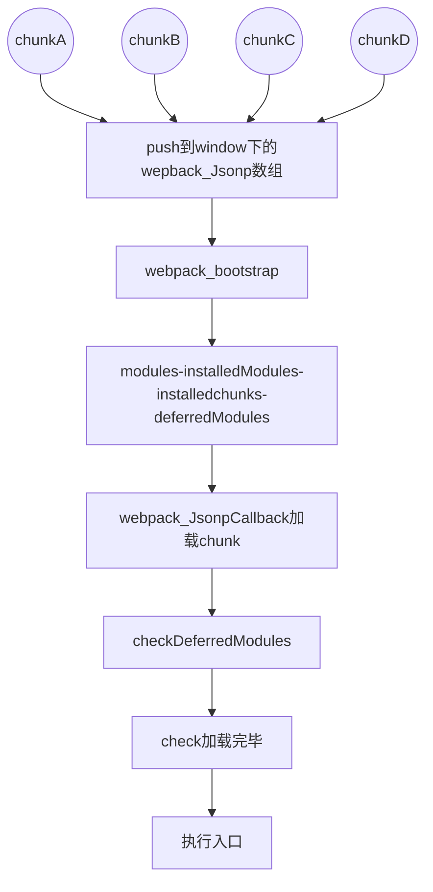

​1)modules​：缓存 ​module​ 代码块，每个 ​module​ 有一个 ​id​，开发环境默认以 ​module​ 所在文件的文件名标识，生产环境默认以一个数字标识。​modules​ 是一个 ​object​， ​key​ 为 ​module id​，​value​ 为对应 ​module​ 的源代码块。

​2) installedModules​：缓存已经加载过的 ​module​，简单理解就是已经运行了源码中 ​import somemodule from 'xxx'​ 这样的语句。​installedModules​ 是一个 ​object​， ​key​ 为 ​module id​，​value​ 为对应 ​module​ 导出的变量。（跟 ​modules​ 的 ​value​ 是不一样的，这里的 ​value​ 保存的是 ​module​ 对应的代码中 ​export​ 的变量）

​3)installedChunks​：缓存已经加载过的 ​chunk​，简单理解就是把其他 ​js​ 文件中的 ​chunk​ 包含的 ​modules​ 同步到了当前文件中。每个 ​chunk​ 有一个 ​id​，默认以一个数字标识。​installedChunks​ 也是一个对象，​key​ 为 ​chunk id​，​value​ 有四种情况：
undefined：chunk not loaded
null：chunk preloaded/prefetched
Promise：chunk loading
0：chunk loaded

​4) deferredModules​：缓存运行当前 ​web app​ 需要的 ​chunk id​ 以及入口 ​module id​（截图中 299 标识入口 ​module​ 的 ​id​，0 和 1 标识运行必需的另外两个 ​chunk​ 的 ​id​），比如，​react​ 和 ​react-dom​ 被单独打包到了另外的 ​js​ 中，入口文件需要等待 ​react​ 和 ​react-dom​ 加载成功之后才能运行（这篇文章不涉及）。

<a href="https://zhuanlan.zhihu.com/p/115100052">https://zhuanlan.zhihu.com/p/115100052</a>

# webpack 如何处理 import()
import() 包含的代码被 webpack 当作 chunk 处理，同样也是通过 window["webapckJsonp"] 来进行加载

import() --> __webpack_require__.e
__webpack_require__.e干了什么 
判断 installedChunks[chunkId] 是否已经被加载，如果已经被加载，直接返回 Promise.all([])

判断 installedChunks[chunkId] 是否在加载中，如果在加载中，把表示加载中的 promise 添加到 promises 数组中

没有加载的话，创建 promise，并赋值：installedChunks[chunkId] = [resolve, reject]，添加到promises 数组中
动态创建 script 标签，添加 onerror 以及 onload 事件，并进行加载超时的处理

影响打包的速度
1.搜索时间 需要获取所有的依赖模块
2.解析所有的依赖模块 解析时间
3.所有依赖模块打包到一个文件 压缩时间
4.二次打包时间 只改动了项目中的一个小小的文件，所有文件都会重新打包，但大部分文件并没有变更

优化 loader 配置
使用 loader 时可以通过 test、include、exclude 三个配置项来命中 loader 要应用规则的文件

优化 resolve.modules 配置
resolve.modules 用于配置 webpack 去哪些目录下寻找第三方模块，resolve.modules 的默认值是 ['node_modules']

优化 resolve.alias 配置
resolve.alias 配置项通过别名来把原导入路径映射成新的导入路径，减少耗时的递归解析操作；

优化 resolve.extensions 配置
在导入语句中没带文件后缀时，webpack 会根据 resolve.extensions 自动带上后缀去尝试询问文件是否存在，所以配置 resolve.extensions 应注意：

resolve.extensions 列表要尽可能小，不要把不存在的后缀添加进去；
高频后缀名放在前面，以便尽快退出超找过程；
在写代码时，尽可能带上后缀名，从而避免寻找过程。

resolve.mainFields 
有一些第三方模块会针对不同环境提供几分代码，路径一般会写在 package.json 中。

# 优化解析时间
thread-loader

hash：每次webpack打包会生成一个唯一的hash值

       问题：因为js和css同时使用一个hash值 如果重新打包会导致所有缓存失效（可能我只改动一个文件）

chunkhash：根据chunk生成hash值。如果打包来源同一个chunk,那么hash值一样

       问题：js和css的hash值还是一样，因为css是在js中被引入的，所以同属于一个chunk

contenthash：根据文件的内容生成hash值。不同文件的hash值一定不一样